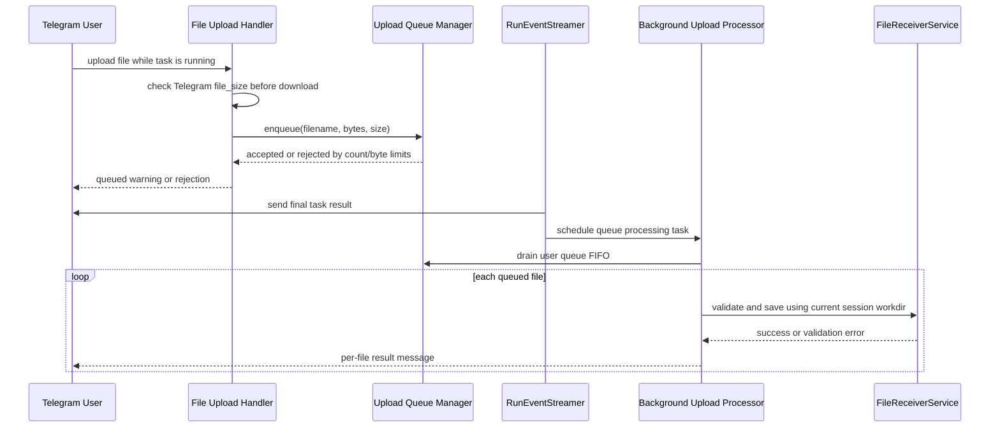

# Priority Fixes Design

## Scope

This design covers the first repair batch approved by the user:

1. Fix upload queue behavior and memory limits.
2. Replace permission callback `tool_use_id` truncation with short tokens.
3. Clean up pending permission state and session lock state.

This batch intentionally does not include broad performance rewrites, AppContainer/TaskService decomposition, or persistent upload/permission state.

## Goals

- Files uploaded during an active task are processed after the task finishes.
- Oversized uploads are rejected before download when Telegram exposes file size metadata.
- Upload queues cannot grow without per-user bounds.
- Telegram permission buttons work for long `tool_use_id` values without truncation or prefix matching.
- Expired callback tokens produce clear recovery instructions.
- Unbound permission pending entries and session lock entries do not accumulate indefinitely.
- Existing command behavior and user-facing flows remain compatible.

## Non-goals

- Persist queued uploads across process restarts.
- Persist callback tokens across process restarts.
- Redesign all pending state registries into a single generic framework.
- Replace filesystem scanning/diff behavior.
- Refactor the full bootstrap or task service architecture.

Restart behavior is intentionally explicit: queued uploads and callback tokens are in-memory only. User-facing messages must state that queued uploads can be lost if the bot restarts, and stale callback messages must tell users how to recover.

## Configuration Summary

| Setting | Type | Default | Purpose |
| --- | --- | --- | --- |
| `UPLOAD_MAX_FILE_SIZE_MB` | existing int | `20` | Maximum single uploaded file size. Used before download when Telegram metadata is available and again during final validation. |
| `UPLOAD_QUEUE_MAX_FILES_PER_USER` | new int | `5` | Maximum number of files queued for one user while a task is running. Set to `0` to disable queuing for uploads received during a running task. |
| `UPLOAD_QUEUE_MAX_BYTES_PER_USER` | new int | `UPLOAD_QUEUE_MAX_FILES_PER_USER * UPLOAD_MAX_FILE_SIZE_MB * 1024 * 1024` | Maximum total queued bytes per user. This default allows up to the configured number of maximum-size files. |
| `CLAUDE_HOOK_PENDING_PERMISSION_TTL_SEC` | existing int | `600` | TTL for pending permission requests and permission callback tokens. |
| `SESSION_LOCK_TTL_SEC` | existing int | `3600` | TTL for ref-counted session locks where `RefCountedLockRegistry` is reused. |

## Design 1: Upload Queue Repair

### Current problem

`app/bot/handlers/file_upload.py` queues uploads in `_pending_uploads` when a user has a running task, but `process_pending_uploads()` has no current app-level caller. The queue stores raw `bytes`, has no count or byte limit, and files are downloaded before size checks in `FileReceiverService`.

### Proposed behavior

Introduce a small upload queue manager for queued uploads. It remains in memory and user-scoped, but enforces:

- `UPLOAD_QUEUE_MAX_FILES_PER_USER`, default `5`.
- `UPLOAD_QUEUE_MAX_BYTES_PER_USER`, default `UPLOAD_QUEUE_MAX_FILES_PER_USER * UPLOAD_MAX_FILE_SIZE_MB * 1024 * 1024`.
- FIFO processing order.

The file upload handlers check Telegram file size metadata before downloading:

- `document.file_size` for documents.
- `photo.file_size` for photos when present.

If the size is over `UPLOAD_MAX_FILE_SIZE_MB`, the handler rejects the file before downloading. After download, the existing `FileReceiverService` validation still runs as the final authority.

When a task reaches a final state, `RunEventStreamer.stream_events()` first sends/edits the final task result message. It then schedules queued upload processing as a tracked background task so task completion feedback is not delayed by upload validation or save operations. The background task processes each queued file against the user's current session workdir by reusing the existing direct-upload processing path; this matches current direct-upload behavior, which resolves the workdir from `SessionService` at processing time. A failed file does not stop later queued files.

The background task must be tracked with a done callback, similar to existing stream task tracking, so unexpected exceptions are logged instead of becoming silent unobserved task failures.

### Sequence

### User-facing behavior

- If a task is running and the queue has capacity, the bot replies that the file was queued and explicitly says queued files are in memory and will be lost if the bot restarts before the task finishes.
- If the queue is full or byte limit is exceeded, the bot rejects the file with a clear reason.
- After task completion, the final task result is shown first. Queued file processing messages follow asynchronously.
- Each queued file produces the same success/rejection message as direct upload.

### Tests

Add or update tests for:

- Download is skipped when Telegram file size exceeds the configured limit.
- Queued uploads are processed after task completion via a background task, after the final task message is sent.
- Queue count and byte limits reject additional files.
- One failed queued file does not prevent later files from being processed.
- Queued-upload reply includes restart-loss wording.

## Design 2: Permission Callback Short Tokens

### Current problem

Permission callback data currently embeds `tool_use_id` and truncates it to fit Telegram's 64-byte callback data limit. The permission response path expects the full `tool_use_id`, so long IDs can make buttons fail as stale or expired.

The same issue exists for external permission callbacks.

### Proposed behavior

Add `PermissionCallbackRegistry`, an in-memory TTL registry mapping short tokens to full `tool_use_id` values.

Callback data changes to:

- Normal permissions: `perm:<decision>:<token>`.
- External permissions: `ext_perm:<token>:<decision>`.

Button builders register the real `tool_use_id`, receive a short token, and place only that token into `callback_data`. Callback handlers resolve the token before calling permission services. If the token is missing or expired, the user sees a stale-button message that says the bot may have restarted or the request expired, and asks the user to trigger the operation again.

### Token generation and collisions

Tokens are generated with `secrets.token_urlsafe(6)`, producing roughly 8 URL-safe characters with 48 bits of entropy. Registration checks for an existing live token and retries generation if a collision occurs. Tokens are unique within the registry's live TTL window.

The token TTL uses `CLAUDE_HOOK_PENDING_PERMISSION_TTL_SEC`, so callback tokens do not outlive the permission request they represent.

### Placement

Place the registry in `app/services/permission_callback_registry.py`. Create one instance in `AppContainer` and inject it into:

- Normal permission handlers.
- External permission handlers.
- Unbound permission handler button creation.

This keeps token ownership explicit without introducing a broad state framework.

### Tests

Add or update tests for:

- Long `tool_use_id` values are not truncated.
- Generated callback data stays under 64 bytes.
- Normal permission callbacks resolve tokens to the full ID.
- External permission callbacks resolve tokens to the full ID.
- Expired or unknown tokens produce a clear stale-button response with recovery instructions.
- Token generation retries on a simulated live-token collision.

## Design 3: Pending and Lock Cleanup

### Unbound permissions

`UnboundPermissionHandler` should remove entries from `_pending` when:

- A user response is accepted and forwarded.
- The TTL expiry path auto-denies the request.

Concurrency should preserve first-responder-wins without holding locks across Telegram or hook socket I/O. Use a short critical section to atomically remove the pending entry and cancel its expiry task. The actual `hook_socket_server.respond_to_permission()` call runs after the entry has been claimed. This briefly serializes dictionary mutations only; responses for unrelated permission requests are not serialized on network or socket I/O.

If forwarding fails after a user response has claimed the request, log the failure and report failure to that user where possible. Do not restore the pending entry, because another user responding later could send a conflicting decision.

### Tmux session locks

`TmuxRunner` currently keeps `_session_locks` indefinitely. Replace this dictionary with the existing `RefCountedLockRegistry`, or wrap the persistent-session critical section with an equivalent ref-counted cleanup path. Reusing `RefCountedLockRegistry` is preferred because it is already configured and tested elsewhere.

Only persistent terminal runs need per-session serialization. Ephemeral runs keep current behavior. Lock cleanup must happen only after the critical section exits and must not remove locks with nonzero references or active waiters.

### Agent file watcher locks

`AgentFileWatcher.forget()` should cancel the watcher task and remove visible task tracking plus all mtime keys for that session immediately. If a watcher task is currently inside `_on_update` / `sync_claude_session`, lock cleanup must be deferred to the watcher's `finally` block after the current callback exits. If no task is running, `forget()` can clean the lock immediately.

`stop_all()` continues to await all watcher tasks, so shutdown performs deterministic cleanup. The watcher `finally` block removes the session lock and any residual mtime keys only when no newer watcher task has been registered for the same session; this avoids deleting state owned by a replacement watcher.

### Tests

Add or update tests for:

- Unbound permission response removes pending state and expiry task.
- Unbound permission expiry removes pending state.
- Concurrent responses for the same unbound permission preserve first-responder-wins.
- Responses for different unbound permissions do not wait on hook socket I/O under a global lock.
- Tmux persistent session lock count does not grow after repeated runs for completed sessions.
- Agent watcher `forget()` clears mtime keys immediately and lock state after the watcher task exits.

## Error Handling

- Upload queue processing logs per-file failures and continues.
- Queued upload background task failures are observed through a done callback and logged.
- Callback token lookup failures return stale-button messages and do not call permission responders.
- Stale-button messages must include recovery text: retry the action or wait for Claude to request permission again.
- Unbound permission response failures are logged after the request has been claimed; the request is not restored.
- Lock cleanup must never delete a lock while it is held or while another coroutine is waiting for it.

## Rollback Plan

- Upload queue changes are localized to the file upload handler, queue manager, and event-stream completion hook. If queued uploads misbehave, disable queueing by setting `UPLOAD_QUEUE_MAX_FILES_PER_USER=0`; uploads received during a running task are rejected instead of queued, while direct uploads when no task is running remain unchanged.
- Permission token changes have no persisted data. If stale buttons spike because TTL is too low, first increase `CLAUDE_HOOK_PENDING_PERMISSION_TTL_SEC`. Users can still respond with `/approve` or `/deny` for the current pending permission. If token routing itself is faulty, revert the permission-token commit and redeploy; no migration is needed.
- Cleanup changes are internal state-management changes. If they cause regressions, revert the cleanup commit; persisted session files are not migrated by this batch.

## Implementation Notes

- Keep changes focused and avoid changing unrelated command behavior.
- Prefer existing service injection patterns in `AppContainer.wire()` and router registration.
- Keep user-facing messages consistent with current Chinese bot messages where the surrounding handler already uses Chinese.
- Do not add persistence unless a later batch explicitly asks for restart-safe behavior.
- Avoid feature flags except the explicit upload-queue off switch; the main rollback path is commit revert because this batch has no schema migration.

## Verification

Run targeted tests for the changed modules, then the full test suite:

- File upload handler tests.
- Permission callback registry tests.
- Permission handler tests.
- External permission/unbound permission tests.
- Tmux runner and agent watcher cleanup tests.
- Full `pytest -q`.
